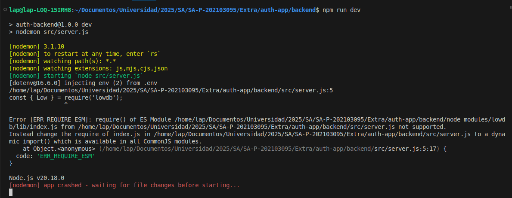
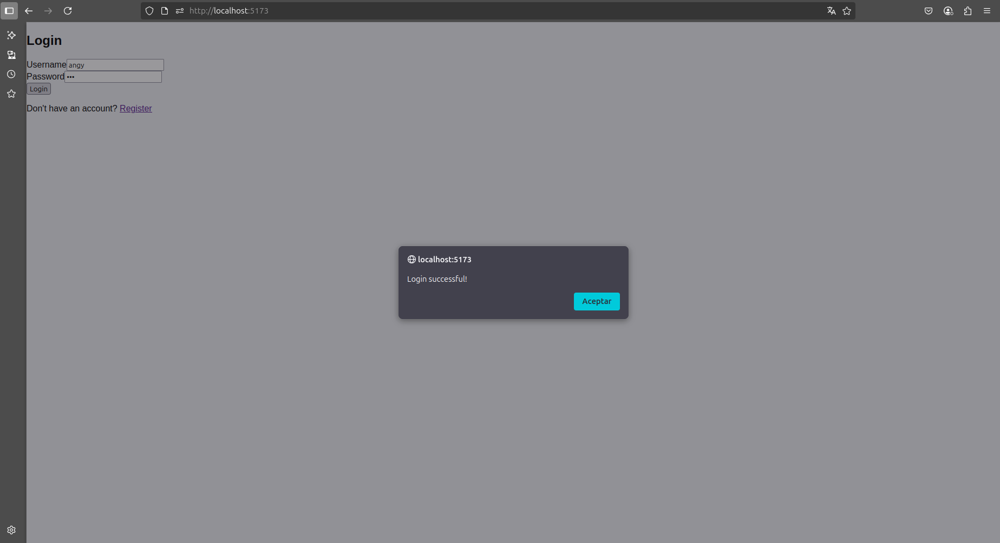
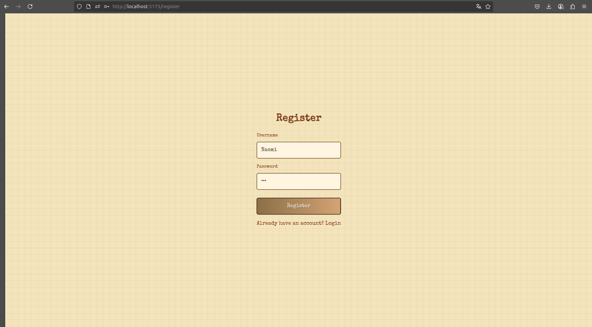
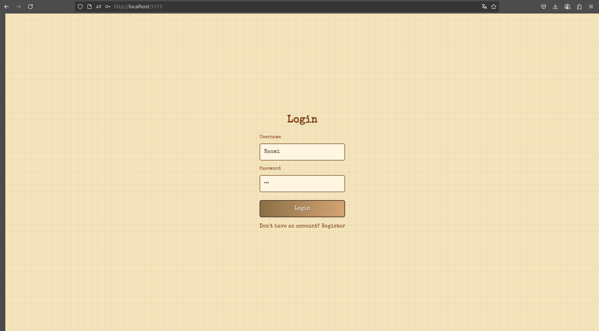
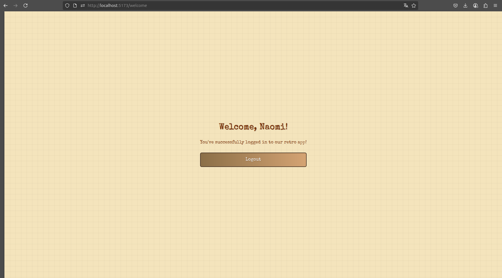

| Nombre | carnet |
| --- | --- |
| Angely Naomi Marroquín Tapaz | 202103095 |

# Documentación Técnica 

A continuación se describe el desarrollo de una aplicación de autenticación fullstack utilizando Grok para la generación del código. La aplicación fue evolucionando a través de varias iteraciones para resolver problemas técnicos y añadir nuevas funcionalidades y estilos.

[Conversación Completa con Gork](https://grok.com/share/c2hhcmQtMg%3D%3D_32c938dc-0ad9-48eb-96f6-694427c56e56)

# Prompt Original

Eres un desarrollador fullstack experto en Node.js y React. Genera el código con una estructura clara y limpia para crear una aplicación de autenticación.

Requisitos funcionales:
1. Login con JWT.
2. Registro de usuarios.

Requisitos técnicos:
1. Backend: Node.js (Express).
2. Base de datos: Archivo JSON (librería de tu preferencia).
3. Frontend: vite+react.
4. Seguridad: encriptación de contraseña.
5. Instrucciones para ejecutar el proyecto.

## Analisis del Prompt

### Fortalezas:

- Objetivo claro: Solicita una app de autenticación con JWT y registro.
- Tecnologías definidas: Node.js, Express, Vite/React, y JSON como DB.
- Seguridad básica: Encriptación de contraseñas incluida.

### Debilidades:
1. **Falta de especificidad técnica:**
    - No define la versión de Node.js/Express ni el formato del JSON (¿lowdb? ¿json-server?).
    - Omite detalles clave como:
    - Estructura de carpetas.
    - Manejo de errores.
    - Validaciones de campos (ej: email válido).
2. **Ambiguidad en librerías:**
    - "Librería de tu preferencia" llevó a usar lowdb sin verificar compatibilidad con CommonJS/ESM.
3. **Frontend no detallado:**
    - No especifica si debe usar hooks, estado global (Context/Redux), o rutas protegidas.

## Salida del prompt original

[Resultado](./authentication-app.md)

La librería lowdb generó error por incompatibilidad con CommonJS:

# Iteración 2: Solución con jsonfile

## Prompt Modificado

La libreria lowdb me genera error por la forma en la que se esta importando. En lugar de cambiar de sistemas de módulos a ESM mejor cambia la libreria para manejar el archivo json por uno que si se adapte a CommonJS.

### Cambios realizados:
- Se reemplazó lowdb por jsonfile
- El backend comenzó a funcionar correctamente
- Nota: Los estilos del frontend aún no funcionaban correctamente

## Resultado

[Salida de iteración 2](./authentication-app(1).md)

# Iteración Final: Diseño y Funcionalidades Adicionales

## Prompt Modificado

A partir de la aplicación de autenticación que generaste previamente, extiende su funcionalidad y diseño con los siguientes requerimientos:
- Estiliza el frontend para que la aplicacion adquiera un diseño retro y vintage utilizando css
Nuevas Funcionalidades:
- Cerrar Sesion
- Después de un login exitoso, redirigir a una página de bienvenida

## Resultado

[Salida de iteración final](./authentication-app(2).md)

### Registro

### Login

### Pagina Inicial

