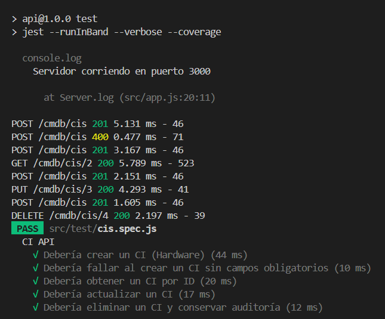
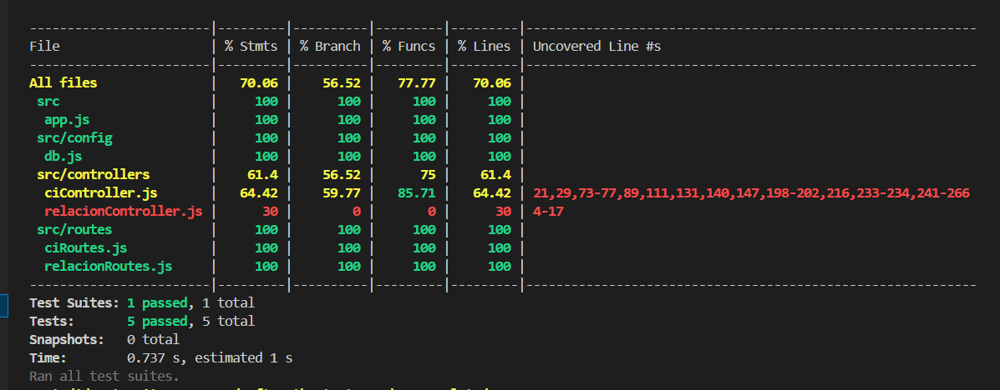

# Pruebas de Integración

Las pruebas de integración del proyecto CMDB aseguran que los endpoints de la API funcionen correctamente con la base de datos MySQL. Se utiliza **Jest** como herramienta de pruebas, junto con **Supertest** para realizar solicitudes HTTP a la API.

## Instalación de Jest y Dependencias

1. **Instalar Jest y Supertest**:
   - Si no están instalados, ejecuta:
     ```bash
     npm install --save-dev jest supertest
     ```
   - Esto instala Jest y Supertest como dependencias de desarrollo.

2. **Configurar Jest**:
   - Asegúrate de que el archivo `package.json` incluya el script de pruebas:
     ```json
     "scripts": {
       "test": "jest --runInBand --verbose --coverage"
     }
     ```
   - Si no está presente, agrégalo manualmente.

3. **Configurar el entorno de pruebas**:
   - El archivo `ciController.test.js` usa tablas temporales en MySQL para evitar modificar la base de datos principal. Asegúrate de que las credenciales en `.env` permitan crear y eliminar tablas temporales.
   - Verifica que la base de datos `cmdb` esté creada y accesible.

## Resultado de las pruebas
### Logs de pruebas



### Reportes

